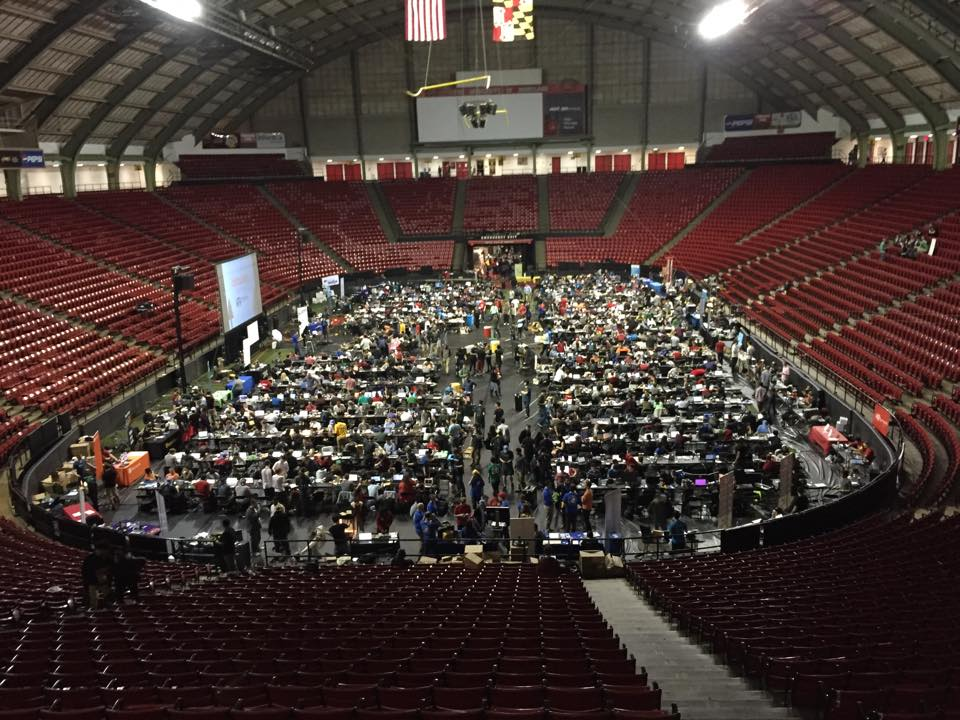
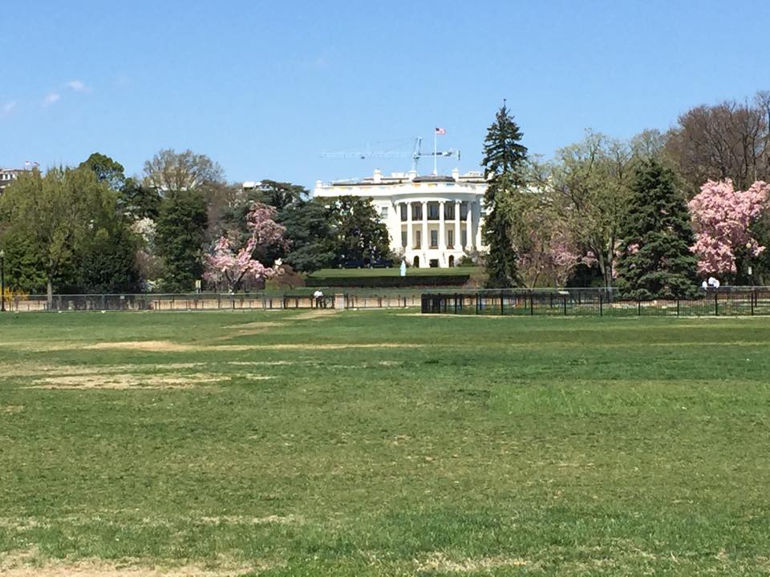

## aka the never ending bus ride part one and two

It was one of those days that just felt gloomy. Clouds filled the sky and blocked the sun and there a slight drizzle, just enough to be annoying. The Stony Brook Computing Society waited at the train station for the bus to arrive to take us to Maryland. It was supposed to arrive at 1pm, at around 1:30pm the bus driver called and told us he was lost on the LIE. After another hour of directions delivered via phone calls, the buses arrived at Stony Brook. To make this situation funnier some of us had convinced our professor to hold a quiz early, angering some of our class. The hour we waited we could have spent in class.

The bus ride to the Bronx to pick up Fordham students went surprisingly well. Things didn’t start to go wrong until we were in New Jersey. The driver hadn’t met with someone to go over the route so he decided to make his own. We ended up making a wrong turn on I-95, turning around, and paying the toll twice. It took us nine hours to get to Maryland, nine.

Once we got to BitCamp things went much better. The organizers were great, running around with network switches and cables to help us set up our workspaces. We made the rounds to the sponsors and my friend and I decided that maybe we should do a project involving data. Washington DC has a lot of data, and they love “Big Data”. We spent a few hours brainstorming but I couldn't come up with a good idea so I decided to make a Pebble app.

 

My app idea was called “Wristipes” (aka Wrist Recipes). I wanted to put short, condensed recipes, on the Pebble screen. I succeeded in making the menus but couldn’t seem to figure out how to make scrolling TextLayers. The Pebble version of C is also interesting because you can’t use malloc or free. Two of the most powerful features of C are off limits so that leads to some interesting issues. In my case it meant I had to bend over backwards to convert numbers.

I wanted to make a simple unit converter, something to convert ounces to cups and tablespoons. To do this I made a few TextLayers and added them to a Window. Then I made a button Click listener to increment and decrement double values I stored in an array. I then wanted to take those values, convert them to a string, and display them in TextLayers. Easy right? Wrong. Because there’s no dynamic memory allocation you can’t use *sprintf()* to convert the double to char* and store it as a string. But you can use *snprintf()* right, because that makes a buffer? I tried, I didn’t get an error that was caught by CloudPebble. I did get another error in the console though, telling me that “doubles cannot be converted to strings using snprintf”. Great.

So I decided to write my own method to do the conversion and that worked. I still haven’t figured out the issue with the ScrollLayer and TextLayer. For some reason setting the text of the TextLayer doesn’t work. You can look at my code in all it’s hacky glory on [Github](https://github.com/toastking/wristipes).

BitCamp was a great hackathon. We took a break on Saturday and made an Stony Brook Computing Society trip to Washington DC to see the Cherry Blossom Festival. That was an experience. I had never been to DC before so it was fantastic to see it during one of it’s biggest events. It was packed, there were more people per square foot than I’ve ever seen! There was an interesting Japanese culture festival with it’s fair share of girls in cat ears and guys in Naruto headbands. But the food there was great. I had some amazing Lo Mein that tasted vaguely like coconut. I also got a sunburn, which is a welcome change after the endless winter we had.

The trip back was also just as long. Though that was welcome. After barely sleeping for two days it was nice to have some time to nap. Though eleven hours may be too long to nap. Our driver was great though, he took the nonstop traffic as a force of nature. It was outside of our control. There was no need to stress about it, it was like a raging river. Except this river was made of cars belching out greenhouse gases. We made it back and I slept better than I had in a long time. I was glued to my bed next morning, I think I hit snooze about ten times before I actually got out of bed.