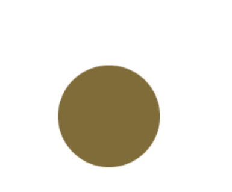
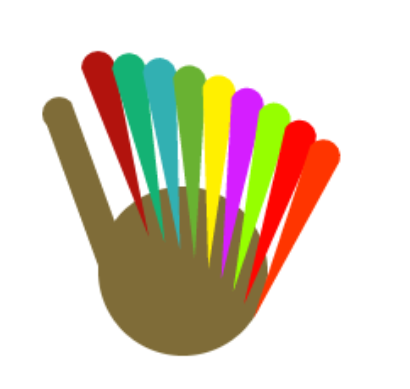
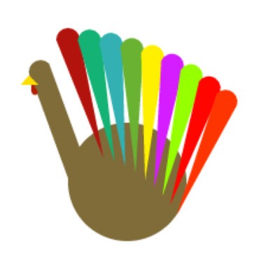
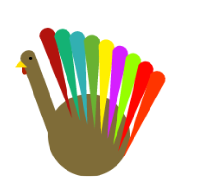

Intro
===========

The Hand Turkey 
---------------

The Hand Turkey is a long fabled Thanksgiving tradition.  Elementary school students around the ~~world~~ United States trace their hands as part of an ~~ ancient pagan ceremony ~~ art class.  We decided to bring this age old tradition into the twenty first century by making the classic turkey with HTML5 canvas and javascript.

## What's HTML5 Canvas?

The *canvas* element is a special tag in HTML.  It creates a media object, similar to an image.  You can change the width and height properties, just like an *img* tag.  The canvas is special because of what it can do.  It is essentially a blank, well, canvas for you to draw on.  You can use Javascript to manipulate it to add stylized text, shapes, images, and much more.  In this tutorial we will use the canvas to draw shapes to make a turkey.

## Additional Resources

There are some very helpful resources on the HTML5 canvas on the world wide web:

- [Mozilla Developer Network](https://developer.mozilla.org/en-US/docs/Web/API/Canvas_API)
- [W3 Schools](http://www.w3schools.com/html/html5_canvas.asp)
- [TutsPlus](http://code.tutsplus.com/series/canvas-from-scratch--net-19650)

# Part 1 - Setup
To start we're going to make a new folder.  You can call it "turkey" or something.  Inside that folder we will make two files - **turkey.html** and **main.js** .  turkey.html will be the main page of that will have a canvas element and the html markup.  Let's make the *canvas* element 500x500.  main.js will hold all the javascript, here we will write the code for creating the shapes on the canvas.  We will link main.js to turkey.html by adding a *script* tag to the head of turkey.html.  

Here's what the turkey.html should look like after you make the canvas element and link the main.js javascript file.

```html{numberLines: true}
<!DOCTYPE html>
<html>
<head>
	<title>Thanksgiving Turkey</title>
	<script type = "text/javascript" src = "./main.js"></script>
</head>
<body>
<canvas width = "500" height = "500">
Thanksgiving turkey goes here.
</canvas>
</body>
```
Now we turn our attention to main.js.  Before we can do anything with the canvas we need to import it into the javascript by using an id property.  We'll change the canvas element to include an id:

```html{numberLines: true}
<canvas id = "turkey" width = "500" height = "500">
Thanksgiving turkey goes here.
</canvas>
```

We can then use this id to select the element in the Javascript code.  First we'll make a new function that we'll do our drawing in.  Inside this function we'll use *document.getElementById()* to select the canvas element. When we select the canvas we also need to get it's *graphics context*.  This is the object that allows us to draw shapes and other fun stuff on the canvas.  In order to call the function when the web page loads we'll add it to the body tag's onload property.  

```javascript{numberLines: true}
function draw(){
	//first we use the id property of the canvas element to get it
	canvas = document.getElementById("turkey");
	if(canvas.getContext){
		//the graphics context is what allows us to draw cool
		//things on the html5 canvas
		var ctx = canvas.getContext("2d");
	}
}
````

```html{numberLines: true}
<body onload="draw()">
<canvas id = "turkey" width = "500" height = "500">
Thanksgiving turkey goes here.
</canvas>
</body>
```

Now that we have our canvas imported and got it's graphics context we can start the fun part, drawing stuff!

Part 2 - Drawing 
===================

Drawing the Body 
-----------------

Turkeys are large, bulbous birds.  Their shape is almost, spherical.  In our highly accurate two dimensional representation of this majestic land fowl we will be making it's body a circle.  

Before we can draw the circle we need to set the fillStyle of the graphics context.  This variable allows us to the change the color of the insides of the shapes we draw.


```javascript
ctx.fillStyle = "rgb(127,108,56)";
```

Now we'll draw the circle.  To do that we'll use the [arc() function](https://developer.mozilla.org/en-US/docs/Web/API/CanvasRenderingContext2D/arc).  After all, a circle is just a 360 degree angle arc right?  The function takes the angle in radians though, so we'll need to remember our high scshool algebra.  360 degrees is 2 PI in radians.  We'll draw our circle near the midde, setting it's center point at 100 x and 200 y.  We'll make the radius of the circle 50 so our turkey is nice and plump.  After we call arc() we need to call **fill()** to fill in the circle we drew with the color we specified in fillStyle earlier.  Here's what the code looks like:

```javascript{numberLines: true}
	//once we set up our canvas and graphics context object we can start drawing!
	//first we'll draw the body of the turkey
	ctx.fillStyle = "rgb(127,108,56)";
	var x = 100; // x coordinate
    var y = 200; // y coordinate
    var radius = 50; // Arc radius
    var startAngle = 0; // Starting point on circle
    var endAngle = Math.PI * 2; // End point on circle
    var anticlockwise = true; // clockwise or anticlockwise

    //draw a circle by making a 360 degree arc
	ctx.arc(x, y, radius, startAngle, endAngle, anticlockwise);

	ctx.fill();
```

And voila! We have a nice turkey body (almost as good as dad bod).



## Drawing the feathers

Ok so we have a body, but what else to turkeys need? That's right, feathers!  

We'll draw two lines and with a half circle as the tip for the feathers.  Drawing on the canvas is like drawing using a pen.  To start drawing "freehand" we call the *beginPath()* function.  First you need to move the pen using the *moveTo()* function.  This is like moving your hand that's holding the pen to a certain point on the canvas.  After we move the pen using moveTo we can use functions such as *arcTo()* and *lineTo()* to make "marks" on the canvas.  In order for the path we drew to appear though we need to call the *stroke()* or *fill()* functions.  The stroke() function makes the lines we drew appear on the canvas.  The fill() method fills in the shape our lines make with a certain color (specified by fillStyle!).  

[Check out this quick Mozilla Development Center tutorial before you proceed!](https://developer.mozilla.org/en-US/docs/Web/API/Canvas_API/Tutorial/Drawing_shapes)

So how can we combine arcs and lines to make something that looks like a feather?  We want to use lines to draw the sides of the feather, then make an arc for the tip of our turkey's feather.  

Our code looks something like this:

```javascript{numberLines: true}
	//now lets draw a feather!
	//set the color to fill the feature
	ctx.fillStyle = "#B2130D";
	ctx.beginPath(); //we're going to draw a feather using a pen
	ctx.moveTo(80, 180);
	ctx.lineTo(60,80);
	ctx.arc(50, 80, 10, 0, Math.PI, true);
	ctx.lineTo(80,180);
	ctx.fill();
```

So now we've drawn one feather.  But a turkey with one feather is one sad turkey!  Let's make some more! But since we're programmers, we like elegant solutions, so let's make a loop to make the other feathers.  

We want the feathers to be different colors, so lets make an array of hexadecimal color codes (as strings) of the different colors we want for the feathers.  We can loop through this array and use fillStyle to make each feather a different color.  

It would also be nice if the feathers were slightly rotated around the turkeys gorgeous bulbous body.  Transformations on the canvas are kinda weird.  They rotate the entire canvas.  So it's kinda like if you wanted to paint a diagonal line, you would rotate the canvas you were drawing on, then just draw a straight line on this rotated canvas.  The *rotate()* method rotates the canvas at a certain angle in radians (time to break out that high school trigonometry again!).  The *translate()* method move the canvas by a certain x and y amount.  We want to rotate our canvas a certain amount, then translate it a little bit, so our feathers rotate and move along the body as we draw them.  

We should also talk about the *save()* and *restore()* functions.  Save() stores the current state of the canvas, it's good to call this before we do any wacky transformations.  Restore() brings back the state of the canvas that we had when we called the save() method.  These functions are useful for restoring the default state of the canvas after transformations.  

Ok, so we have our colors for our feathers, we have the code to make our feathers, we know how rotating works, let's make our loop!


```javascript{numberLines: true}
	//we're gonna save the canvas state since we're moving it around
	ctx.save();
	//now let's draw the next four using a loop
	for(var i = 1; i < 9; i++){
		ctx.fillStyle = colors[i]; //choose the color for the feather
		//rotate the feather to give it a cool effect
		ctx.rotate((Math.PI/180)*(5));
		ctx.translate(25,-5);
		ctx.beginPath();
		ctx.moveTo(80, 180);
		ctx.lineTo(60,80);
		ctx.arc(50, 80, 10, 0, Math.PI, true);
		ctx.lineTo(80,180);
		ctx.fill();
	}

	//restore the canvas state after all those wacky transformations
	ctx.restore();
```
	

## Drawing the Neck ##

When my cousin was very little she was very confused by turtleneck sweaters.  She would always get flustered and say, "turtles have no necks!".  Turkeys have necks though, so lets draw one.

I did some fancy math using triangles and stuff to determine what coordinates and angles we need to use.  *Remember! All the angles in Javascript are in radians!*  We need to start around the midpoint of the turkey's body.  Doing some math with the radius and the center of the circle I chose this to be (65,185).  We move our pen to this area and start drawing.  Like our feathers, our neck and head will consist of two lines and a half circles (arc) at 45 degrees.  We'l also draw the gizzard a similar way, drawing a line straight down from the neck and then drawing a half circle (with a start angle of 180 degrees and and end angle of 180 degrees).



**Now is a good time to talk about a weird thing with drawing paths.**  Paths have *main paths* and *sub paths*.  Every time you use *moveTo()* you make a new subpath.  This can mess with the *fill()* function since it tries to automatically close the path (similar to the closePath() function).  It's best not to use moveTo() that often.  It's better to use moveTo() when you call beginPath() and then use lineTo() and other functions from there on out until the path is done.

Here's the cool math and the code we used to make the neck (*warning: it uses lots of trigonometry*):


```javascript{numberLines: true}
//now let's draw the turkey's neck and eyes!
	//we're going to use two lines and arc
	//the arc is a Bezier curve
	ctx.fillStyle = "rgb(127,108,56)";
	ctx.beginPath();
	//we did some fancy trig to get these numbers
	ctx.moveTo(65,185);
	ctx.lineTo(34, 100);
	//let's make the head of the turkey an arc
	ctx.save();
	//rotate the canvas
	var k = Math.sin((Math.PI/180) * 45) *10; // the constant value we are using
	var x = 34 - k;
	var y = 100 + k;
	ctx.arc(x, y, 10, (Math.PI/180)*-45, (Math.PI/180)*135, true);
	//now we draw the other line to finish the neck
	k = Math.sin((Math.PI/180) * 45) *20;
	ctx.translate(-k,k); //use translate so the line is the same
	//do this little trick to get the right coordinates without calculating them
	ctx.lineTo(65,185);
	ctx.restore();

	//fun fact, fill can automatically close the path!
	ctx.fill();

	//now we will draw the gizzard 
	ctx.fillStyle = "#B22003";
	ctx.beginPath();
	ctx.moveTo(19,113);
	ctx.lineTo(19,124);
	ctx.arc(22,124,2.5, Math.PI, Math.PI*2, true);
	ctx.fill();
```	

## The Beak ##

The beak is a very important part of the turkey.  It allows it to utter it's beautiful bird calls, also called "the gobble".  We're going to make our beak an orange triangle on the end of the head of our turkey.  We'll use to lines and then fill() to end the path automatically.  I started the path for the beak a little above where we made the part that goes under the neck.



```javascript{numberLines: true}
//let's draw the beak!
	ctx.fillStyle = "#FFDE00";
	ctx.beginPath();
	ctx.moveTo(17,110);
	ctx.lineTo(10,118);
	ctx.lineTo(25,118);
	ctx.fill(); 
```

## Look, Look with Your Special Eyes!
There is just one last thing we need to add to make our turkey complete.  Eyes!  This should be easy by now, it's just a circle in the middle of it's head!  

```javascript{numberLines: true}
	//to finish it off let's draw the eyes!
	ctx.fillStyle = "#000000";
	ctx.beginPath();
	ctx.arc(29,107,2,0,Math.PI*2,false);
	ctx.fill();
```

**And with that we are finished! It's it beautiful?**



*You can see the finished code at* [github.com/toastking/html5turkey](https://github.com/toastking/html5turkey)! 

# What next?
- [Animate it!](https://developer.mozilla.org/en-US/docs/Web/API/Canvas_API/Tutorial/Basic_animations)
- Modify the program so it generates a random color for each feather instead of using the pre-made array in the loop.
- [Try out a javascript framework!](http://www.createjs.com/)
- Go eat some Thanksgiving Turkey! (and gravy!)


