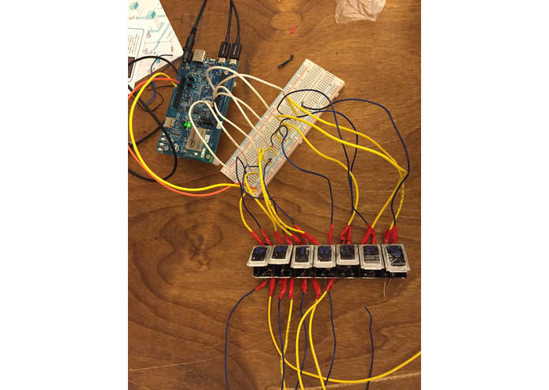

I have made several projects that are available on [Github](https://github.com/toastking).  Most of these were made at [hackathons](http://en.wikipedia.org/wiki/Hackathon), but a few are side projects I made over breaks from school.  

# [Fudge](https://github.com/FudgeInc/Fudge) - CodePath Spring 2016

I made an iPhone app with a team of two other people for the Codepath iOS Bootcamp.  I was part of their first class in Universities.  Fudge is a recipe storing app that allows users to create collections of recipes and store them in the cloud.  We used Parse to make the backend.  

# [PillStacks](https://github.com/NazimAmin/PennAppsIOTPillBox) - PennApps Winter 2015

Over winter break I attended [PennApps Winter 2015](http://2015s.pennapps.com/) with [one of my friends from Stony Brook](https://github.com/NazimAmin).  He had previous experience using the [Intel Galileo](http://en.wikipedia.org/wiki/Intel_Galileo) development board and he wanted to make something with Intel's new board, the [Edision](http://en.wikipedia.org/wiki/Intel_Edison).  We came up with the idea of an Internet Of Things style pillbox after discussing the difficulties some of our family members' had ensuring their loved ones were taking their medications.  

The idea was to make a pillbox that could tell what day it was (using the Edison) and then tell the user which box to take pills from.  It would also check if the pills for the day were taken and send that data to a web app.  The web app was made by our two other [amazing](https://github.com/airrick213) [teammates](https://github.com/avarun42).  The web app would display if the user had taken the pills in the box or not.  

We used LED's and photoresistors as sensors to see if the pills were in the box or not.  This lead to an interesting issue, we needed to ensure the box was completely opaque so no light would get in and change our sensor values.  After a late night trip to the CVS near the UPenn campus we decided to use white out and Sharpie's to "paint" our pill box.  The advantage of using a photoresistor was the versatility of the sensor.  We could tell by the value of the sensor if the compartment was open or not.  From there we could decide whether to turn the light for the compartment on or off if the compartment was for the current day.  This allowed us to light up the pill compartment for the current day so it's easier for the user to tell which day's pills to take.  

Our project ended up winning an *Honorable Mention in the Health Category*! Check it out on [ChallengePost](http://challengepost.com/software/pillstacks) and [Github](https://github.com/NazimAmin/PennAppsIOTPillBox)!

# [SongWritr](https://github.com/tektekPush/songwritr) - UnHackathon Fall 2014

I created this app with a team of [three](https://github.com/mgenkin) [other](https://github.com/taylorwan) [people](https://github.com/tektekPush) at UnHackathon, a hackathon run by [Stony Brook University's Computer Society](https://sbcs.io/).  Songwritr uses the [Create.js](http://createjs.com/Home) to manipulate the HTML5 canvas and create lyrics sheets with chords attached to them.  We also added features to export the sheet music from the canvas into an image.  *Songwritr won the Best App for The Creation of Content* at Unhackathon!

Check out the project on [ChallengePost](http://challengepost.com/software/songwritr) or [Github](https://github.com/tektekPush/songwritr)!    
